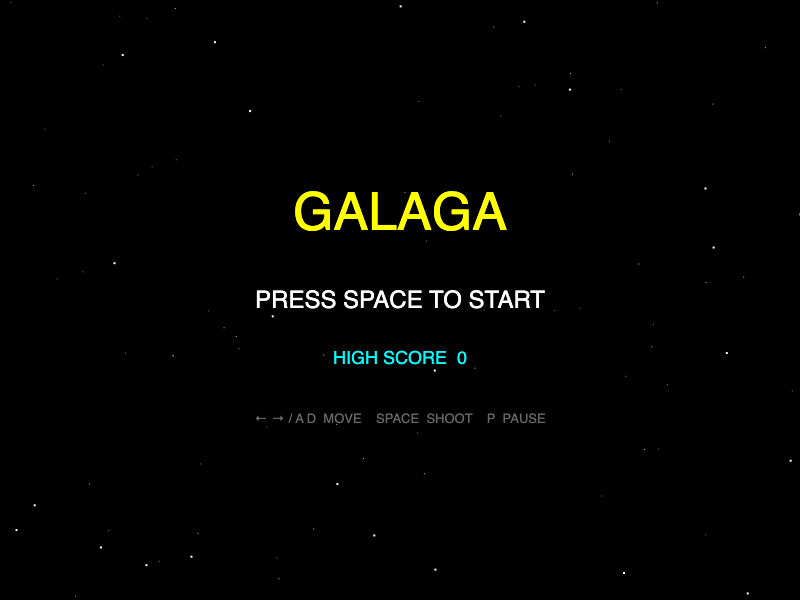
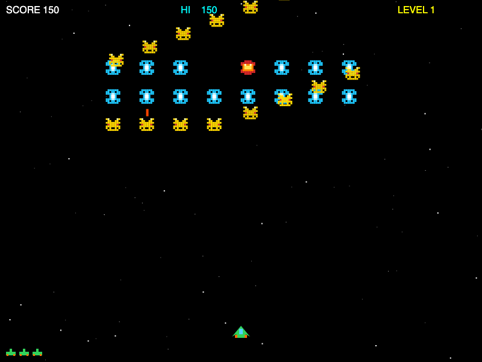

# 🚀 Galaga — C# / Avalonia Clone

A faithful arcade recreation of the classic **Galaga** (1981) built with **.NET 8** and **Avalonia UI**, featuring pixel-art sprites drawn entirely in code, synthesized retro audio, and a clean entity-based game engine.

```
 ██████╗  █████╗ ██╗      █████╗  ██████╗  █████╗
██╔════╝ ██╔══██╗██║     ██╔══██╗██╔════╝ ██╔══██╗
██║  ███╗███████║██║     ███████║██║  ███╗███████║
██║   ██║██╔══██║██║     ██╔══██║██║   ██║██╔══██║
╚██████╔╝██║  ██║███████╗██║  ██║╚██████╔╝██║  ██║
 ╚═════╝ ╚═╝  ╚═╝╚══════╝╚═╝  ╚═╝ ╚═════╝ ╚═╝  ╚═╝
```

---

## 📸 Screenshots

| Menu | Gameplay |
|------|----------|
|  |  |

---

## ✨ Features

- 🎮 **Classic Galaga gameplay** — formation entry, diving attacks, oscillating enemy grid
- 🖼️ **Pixel-art sprites** — Bee, Butterfly, Boss Galaga, and player ship, all drawn with Avalonia geometry (no image files)
- 🎞️ **2-frame enemy animation** — wings flap at ~7.5 Hz, matching the original arcade feel
- 💥 **Explosion effects** — expanding particle bursts (white → yellow → orange → red)
- 🔊 **Synthesized audio** — shoot, explosion, player death, and stage-clear sounds generated as PCM waveforms via OpenAL
- 📈 **Progressive difficulty** — enemy speed and shooting rate increase with each level
- 🏆 **Persistent high score** — tracked across resets within a session

---

## 🕹️ Controls

| Key | Action |
|-----|--------|
| `←` / `A` | Move left |
| `→` / `D` | Move right |
| `Space` | Shoot / Start game / Retry |
| `P` | Pause / Resume |
| `Esc` | Return to main menu |

> **Tip:** You can have at most **2 player bullets** on screen at once — just like the original.

---

## 👾 Enemy Types & Scoring

```
┌──────────────────┬──────────────┬─────────────────┬─────────────┐
│ Enemy            │ Appearance   │ In Formation    │ Diving      │
├──────────────────┼──────────────┼─────────────────┼─────────────┤
│ Bee              │ Yellow       │ 50 pts          │ 100 pts     │
│ Butterfly        │ Cyan         │ 80 pts          │ 160 pts     │
│ Boss Galaga      │ Red/Orange   │ 150 pts         │ 400 pts     │
└──────────────────┴──────────────┴─────────────────┴─────────────┘
```

**Formation layout (5 rows × 8 columns = 40 enemies per stage):**
```
Row 0: ✦ ✦ ✦ [B] [B] ✦ ✦ ✦   ✦ = Butterfly,  B = Boss Galaga
Row 1: ✦ ✦ ✦  ✦   ✦  ✦ ✦ ✦
Row 2: ✶ ✶ ✶  ✶   ✶  ✶ ✶ ✶   ✶ = Bee
Row 3: ✶ ✶ ✶  ✶   ✶  ✶ ✶ ✶
Row 4: ✶ ✶ ✶  ✶   ✶  ✶ ✶ ✶
```

### Game Rules
- **3 lives** to start; the ship respawns after **2 seconds**
- Stage clear when all 40 enemies are destroyed; next level begins after 2.5 s
- Up to **2 enemies dive simultaneously**; divers loop back from the top if they miss

---

## 🚀 Getting Started

### Prerequisites

- [.NET 8 SDK](https://dotnet.microsoft.com/download/dotnet/8.0)
- macOS, Linux, or Windows (audio requires an OpenAL-compatible device)

### Build & Run

```bash
# Clone the repository
git clone https://github.com/your-username/Galaga.git
cd Galaga

# Run the game
dotnet run --project Galaga/Galaga.csproj

# Run tests
dotnet test

# Run a single test
dotnet test --filter "FullyQualifiedName~Player_dies_when_hit_by_enemy_bullet"

# Release build
dotnet publish Galaga/Galaga.csproj -c Release -o publish/
```

---

## 🏗️ Architecture

```
Galaga/
├── Engine/
│   ├── GameEngine.cs       # Pure game logic: tick loop, collision, AI, scoring
│   └── GameState.cs        # All mutable state (phase, score, lives, entity lists)
├── Entities/
│   ├── Entity.cs           # Abstract base: position, size, AABB collision
│   ├── Player.cs           # Movement, bullet cap, respawn timer
│   ├── Enemy.cs            # Per-enemy state machine
│   ├── EnemyFormation.cs   # Grid layout, oscillation, entry waves
│   ├── Bullet.cs           # Direction determined by BulletOwner enum
│   └── Explosion.cs        # Visual-only particle burst data
├── Views/
│   ├── GameCanvas.cs       # Avalonia Control: 60 fps timer, key events, Render()
│   └── SpriteRenderer.cs   # All drawing code (pixel-art + geometry)
└── Audio/
    └── SoundPlayer.cs      # OpenAL synthesis (shoot, explosion, death, arpeggio)
```

### Data Flow

```
GameCanvas.OnTick(16ms)
    │
    ├─► GameEngine.Tick(dt)   ──► mutates GameState
    │       │                        │
    │       ├─ player / formation    ├─ Bullets list
    │       ├─ collision detection   ├─ Explosions list
    │       └─ enqueue SoundEffects  └─ PendingSounds queue
    │
    ├─► SoundPlayer.Play()    ◄── dequeues PendingSounds
    │
    └─► InvalidateVisual()    ──► GameCanvas.Render(DrawingContext)
                                      │
                                      ├─ SpriteRenderer.DrawEnemy(frame)
                                      ├─ SpriteRenderer.DrawPlayer()
                                      ├─ SpriteRenderer.DrawExplosion()
                                      └─ HUD / overlay text
```

### Enemy State Machine

```
FormationEntry ──(arrives at slot)──► InFormation
                                          │
                               (random dive trigger)
                                          │
                                          ▼
                                       Diving ──(off-screen bottom)──► Returning
                                                                            │
                                                                 (arrives at slot)
                                                                            │
                                                                            ▼
                                                                      InFormation
```

> **Key rule:** In `InFormation` state, `Enemy.Update()` **snaps** `X/Y` to `FormationX + oscillationOffset` every tick. Setting `X`/`Y` directly has no lasting effect unless `FormationX`/`FormationY` are also updated.

---

## 🔊 Audio

Sounds are synthesized at runtime as 22050 Hz PCM and played via **OpenAL** (`Silk.NET.OpenAL`). No audio files are included. If OpenAL is unavailable, the game runs silently.

| Sound | Synthesis |
|-------|-----------|
| Shoot | Square wave, 820 → 160 Hz sweep, 90 ms |
| Enemy explosion | White noise + 80 Hz rumble, 220 ms |
| Player death | Square wave, 580 → 55 Hz sweep, 600 ms |
| Stage clear | C4–E4–G4–C5 arpeggio, square wave |

---

## 🧪 Tests

```bash
dotnet test
```

13 unit tests cover the `GameEngine` and `Entities` layers (no UI dependency):

- Player lives, bullet cap, respawn
- Collision detection (AABB, dead-entity guard)
- Score (formation vs. diving bonus)
- Game-over and stage-clear transitions
- Formation initialization

---

## 🛠️ Tech Stack

| Component | Technology |
|-----------|-----------|
| Language | C# 12 / .NET 8 |
| UI & rendering | [Avalonia UI](https://avaloniaui.net/) 11 |
| Audio | [Silk.NET.OpenAL](https://github.com/dotnet/Silk.NET) 2.23 |
| Tests | xUnit |
| Sprites | Pure code (pixel-art rectangles + `StreamGeometry`) |

---

## 📄 License

MIT
