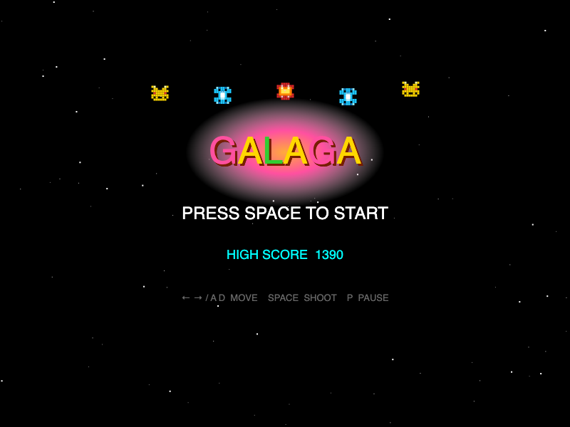
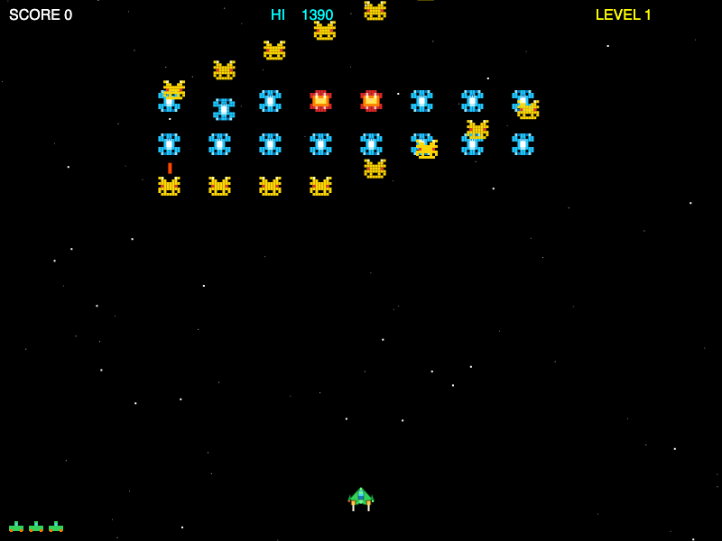

# 🚀 Galaga — Clone in C# / Avalonia

Una fedele ricreazione arcade del classico **Galaga** (1981), realizzata con **.NET 8** e **Avalonia UI**: sprite pixel-art disegnati interamente in codice, audio retro sintetizzato e un motore di gioco pulito basato su entità.

```
 ██████╗  █████╗ ██╗      █████╗  ██████╗  █████╗
██╔════╝ ██╔══██╗██║     ██╔══██╗██╔════╝ ██╔══██╗
██║  ███╗███████║██║     ███████║██║  ███╗███████║
██║   ██║██╔══██║██║     ██╔══██║██║   ██║██╔══██║
╚██████╔╝██║  ██║███████╗██║  ██║╚██████╔╝██║  ██║
 ╚═════╝ ╚═╝  ╚═╝╚══════╝╚═╝  ╚═╝ ╚═════╝ ╚═╝  ╚═╝
```

---

## 📸 Screenshot

| Menu | Gameplay |
|------|----------|
|  |  |

---

## ✨ Funzionalità

- 🎮 **Gameplay classico di Galaga** — entrata in formazione, attacchi in picchiata, griglia nemica oscillante
- 🌟 **Sfondo stellare dinamico** — 90 stelle con parallasse a 3 velocità, rigenerate casualmente ad ogni partita
- 🖼️ **Sprite pixel-art** — Ape, Farfalla, Boss Galaga e navicella del giocatore, tutti disegnati con geometria Avalonia (nessun file immagine)
- 🎞️ **Animazione nemica a 2 frame** — le ali battono a ~7,5 Hz, fedele alla sensazione dell'arcade originale
- 💥 **Effetti esplosione** — particelle in espansione (bianco → giallo → arancione → rosso)
- 💀 **Collisione nemico-giocatore** — i nemici in picchiata uccidono il giocatore al contatto
- 🔊 **Audio sintetizzato** — sparo, esplosione, morte del giocatore e suoni di fine livello generati come forme d'onda PCM tramite OpenAL
- 📈 **Difficoltà progressiva** — i nemici si muovono più velocemente e la frequenza di fuoco aumenta ad ogni livello
- 🏆 **Punteggio massimo persistente** — mantenuto tra i reset durante la sessione
- 🚀 **Navicella migliorata** — ali sagomate, abitacolo con highlight, bagliori motore a due toni

---

## 🕹️ Controlli

| Tasto | Azione |
|-------|--------|
| `←` / `A` | Muovi a sinistra |
| `→` / `D` | Muovi a destra |
| `Spazio` | Spara / Avvia partita / Riprova |
| `P` | Pausa / Riprendi |
| `Esc` | Torna al menu principale |

> **Suggerimento:** Puoi avere al massimo **2 proiettili del giocatore** sullo schermo contemporaneamente — proprio come nell'originale.

---

## 👾 Tipi di nemici e punteggi

```
┌──────────────────┬──────────────┬─────────────────┬─────────────┐
│ Nemico           │ Aspetto      │ In formazione   │ In picchiata│
├──────────────────┼──────────────┼─────────────────┼─────────────┤
│ Ape              │ Giallo       │ 50 pt           │ 100 pt      │
│ Farfalla         │ Ciano        │ 80 pt           │ 160 pt      │
│ Boss Galaga      │ Rosso/Arancio│ 150 pt          │ 400 pt      │
└──────────────────┴──────────────┴─────────────────┴─────────────┘
```

**Disposizione della formazione (5 righe × 8 colonne = 40 nemici per livello):**
```
Riga 0: ✦ ✦ ✦ [B] [B] ✦ ✦ ✦   ✦ = Farfalla,  B = Boss Galaga
Riga 1: ✦ ✦ ✦  ✦   ✦  ✦ ✦ ✦
Riga 2: ✶ ✶ ✶  ✶   ✶  ✶ ✶ ✶   ✶ = Ape
Riga 3: ✶ ✶ ✶  ✶   ✶  ✶ ✶ ✶
Riga 4: ✶ ✶ ✶  ✶   ✶  ✶ ✶ ✶
```

### Regole di gioco
- **3 vite** iniziali; la navicella riappare dopo **2 secondi**
- Il livello termina quando tutti i 40 nemici sono distrutti; quello successivo inizia dopo 2,5 s
- Fino a **2 nemici in picchiata simultaneamente**; i picchiatori che mancano il bersaglio curvano verso il basso ed escono dallo schermo, poi rientrano dall'alto
- I nemici in picchiata che **colpiscono il giocatore** lo uccidono e muoiono a loro volta

---

## 🚀 Per iniziare

### Prerequisiti

- [.NET 8 SDK](https://dotnet.microsoft.com/download/dotnet/8.0)
- macOS, Linux o Windows (l'audio richiede un dispositivo compatibile OpenAL)

### Compilazione ed esecuzione

```bash
# Clona il repository
git clone https://github.com/your-username/Galaga.git
cd Galaga

# Avvia il gioco
dotnet run --project Galaga/Galaga.csproj

# Esegui i test
dotnet test

# Esegui un singolo test
dotnet test --filter "FullyQualifiedName~Player_dies_when_hit_by_enemy_bullet"

# Build di rilascio
dotnet publish Galaga/Galaga.csproj -c Release -o publish/
```

---

## 🏗️ Architettura

```
Galaga/
├── Engine/
│   ├── GameEngine.cs       # Logica di gioco pura: ciclo tick, collisioni, IA, punteggio
│   └── GameState.cs        # Tutto lo stato mutabile (fase, punteggio, vite, liste entità)
├── Entities/
│   ├── Entity.cs           # Base astratta: posizione, dimensione, collisione AABB
│   ├── Player.cs           # Movimento, limite proiettili, timer respawn
│   ├── Enemy.cs            # Macchina a stati per ciascun nemico
│   ├── EnemyFormation.cs   # Griglia, oscillazione, ondate di entrata
│   ├── Bullet.cs           # Direzione determinata dall'enum BulletOwner
│   └── Explosion.cs        # Dati visivi della particella di esplosione
├── Views/
│   ├── GameCanvas.cs       # Controllo Avalonia: timer 60 fps, eventi tastiera, Render()
│   └── SpriteRenderer.cs   # Tutto il codice di disegno (pixel-art + geometria)
└── Audio/
    └── SoundPlayer.cs      # Sintesi OpenAL (sparo, esplosione, morte, arpeggio)
```

### Flusso dei dati

```
GameCanvas.OnTick(16ms)
    │
    ├─► GameCanvas.UpdateStars(dt)   ── parallasse delle stelle
    │
    ├─► GameEngine.Tick(dt)          ──► modifica GameState
    │       │                              │
    │       ├─ giocatore / formazione      ├─ lista Bullets
    │       ├─ collisioni (proiettili +    ├─ lista Explosions
    │       │  nemico-giocatore)           └─ coda PendingSounds
    │       └─ accoda SoundEffects
    │
    ├─► SoundPlayer.Play()    ◄── estrae da PendingSounds
    │
    └─► InvalidateVisual()    ──► GameCanvas.Render(DrawingContext)
                                      │
                                      ├─ SpriteRenderer.DrawEnemy(frame)
                                      ├─ SpriteRenderer.DrawPlayer()
                                      ├─ SpriteRenderer.DrawExplosion()
                                      └─ HUD / testi overlay
```

### Macchina a stati del nemico

```
FormationEntry ──(raggiunge lo slot)──► InFormation
                                             │
                                  (innesco casuale picchiata)
                                             │
                                             ▼
                                          Diving ──(fuori schermo in basso)──► Returning
                                                                                    │
                                                                       (raggiunge lo slot)
                                                                                    │
                                                                                    ▼
                                                                              InFormation
```

> **Regola chiave:** Nello stato `InFormation`, `Enemy.Update()` **aggancia** `X/Y` a `FormationX + oscillationOffset` ad ogni tick. Impostare `X`/`Y` direttamente non ha effetto duraturo se non vengono aggiornati anche `FormationX`/`FormationY`.
>
> **Collisione con il giocatore:** I nemici in stato `Diving` che toccano il giocatore lo uccidono e muoiono a loro volta.

---

## 🔊 Audio

I suoni vengono sintetizzati a runtime come PCM a 22050 Hz e riprodotti tramite **OpenAL** (`Silk.NET.OpenAL`). Nessun file audio incluso. Se OpenAL non è disponibile, il gioco funziona senza audio.

| Suono | Sintesi |
|-------|---------|
| Sparo | Onda quadra, sweep 820 → 160 Hz, 90 ms |
| Esplosione nemica | Rumore bianco + rumble 80 Hz, 220 ms |
| Morte del giocatore | Onda quadra, sweep 580 → 55 Hz, 600 ms |
| Fine livello | Arpeggio Do4–Mi4–Sol4–Do5, onda quadra |

---

## 🧪 Test

```bash
dotnet test
```

16 test unitari coprono i livelli `GameEngine` ed `Entities` (nessuna dipendenza dall'interfaccia grafica):

- Vite, limite proiettili e respawn del giocatore
- Rilevamento collisioni (AABB, guardia entità morte)
- Punteggio (bonus formazione vs. picchiata)
- Transizioni game over e fine livello
- Inizializzazione della formazione
- Morte del giocatore per collisione con nemico in picchiata

---

## 🛠️ Stack tecnologico

| Componente | Tecnologia |
|------------|-----------|
| Linguaggio | C# 12 / .NET 8 |
| UI e rendering | [Avalonia UI](https://avaloniaui.net/) 11 |
| Audio | [Silk.NET.OpenAL](https://github.com/dotnet/Silk.NET) 2.23 |
| Test | xUnit |
| Sprite | Puro codice (rettangoli pixel-art + `StreamGeometry`) |

---

## 📄 Licenza

MIT
